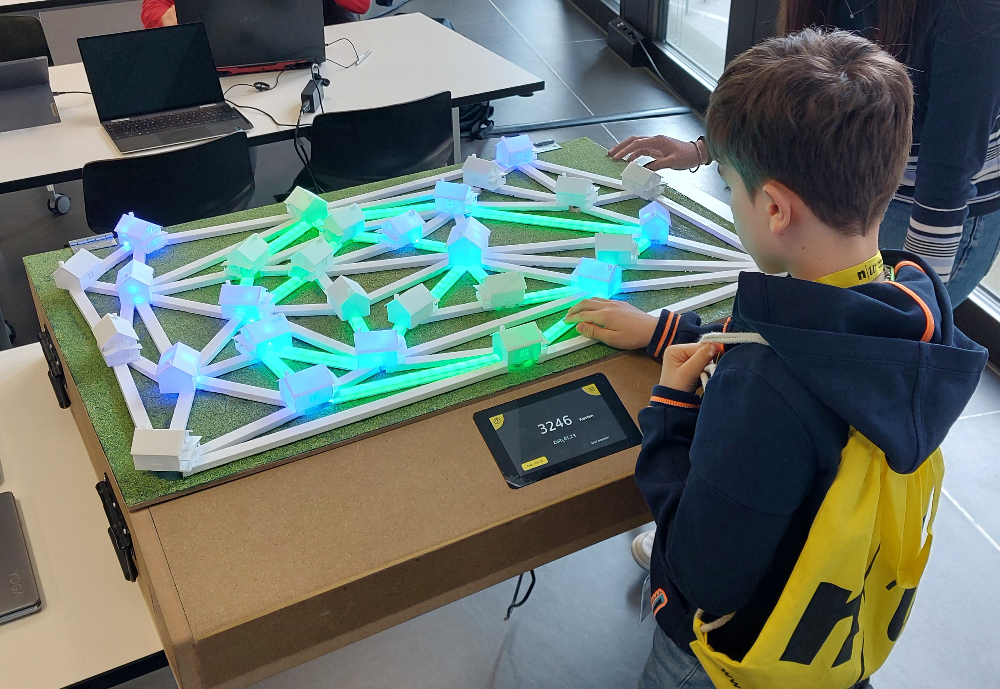

# ip12-22vt_ladestationen
FHNW Computer Science Student Project Semester 1&2

# Connect 'n Charge
  

Connect 'n Charge ist ein strategisches Brettspiel, bei dem die Spieler dazu aufgefordert werden, Netzwerkverbindungen zu verknüpfen und dabei Ressourceneffizienz zu optimieren.
Die Spieler übernehmen die Rolle des Managers einer idyllischen Feriensiedlung mit 30 Ferienhäusern, die dazu beitragen sollen, umweltfreundliche Mobilität zu fördern, indem 13 Häuser mit modernen E-Ladestationen ausgestattet werden.
Die Herausforderung liegt dabei in der optimalen Nutzung von Ressourcen und der Schaffung eines effizienten Verteilungsnetzes.

Check out the latest [JavaDoc](https://fhnw-sgi-ip12-22vt.github.io/ip12-22vt_ladestationen/apidocs/ch.ladestation.connectncharge/module-summary.html) on our [Project Pages](https://fhnw-sgi-ip12-22vt.github.io/ip12-22vt_ladestationen/)

## Setup in IntelliJ IDEA
This repo on GitHub is a fusion of the code and docu repositories, which is why it's a bit tricky to open it as a maven project in Intellij IDEA:

1. Open the repository folder (parent folder of the docu and connectncharge folders)
1. Quickly press shift twice
1. In the popup window, search `Add Maven Projects`

4. Select the folder containing the pom.xml file (`connectncharge/`)
4. To test it, execute a maven goal like `package` in the maven sidebar on the right-hand-side. It should try to build the project.

## Verwendete Hardware

Die folgende Liste zeigt alle Hardware-Komponenten, die im "Connect 'n Charge" Spiel verwendet werden.

Die meisten dieser Komponenten sind leicht in Elektronikfachgeschäften oder online erhältlich.
Achten Sie darauf, die entsprechenden Datasheets und Spezifikationen zu überprüfen, um sicherzustellen, dass Sie die richtigen Teile kaufen.

Ausserdem ist es wichtig zu beachten, dass einige dieser Teile verschleissen können, insbesondere die Taster und die LED-Streifen. Es ist daher ratsam, einige Ersatzteile zur Hand zu haben.
- **Raspberry Pi Modell B:** Dies ist das Herzstück des Spiels, das die gesamte Verarbeitung und Steuerung übernimmt.
- **RaspberryPi-Display 7":** Ein 7-Zoll-Touchscreen-Display, das zur Anzeige von Informationen und zur Interaktion mit dem Spiel verwendet wird.
- **LED-Strip (WS2812b, White PCB, 60LED/m):** Dieser wird verwendet, um den Status der einzelnen Knotenpunkte visuell darzustellen.
- **Schaltnetzteil (DC 5V 20A 100W):** Dieses versorgt das gesamte System mit Strom.
- **TACT SWITCH, 12 x 12mm, 4PIN/THT:** Diese werden als Taster für die Interaktion mit dem Spiel verwendet.
- **Flachbandkabel und Flachbandstecker/-sockel:** Diese werden für die Verbindungen zwischen den verschiedenen Komponenten verwendet.
- **Europlatinen:** Auf diesen werden die Taster montiert.
- **GPIO-Extension-ICs (MCP23S17):** Diese werden verwendet, um mehr GPIO-Pins für den Raspberry Pi bereitzustellen.
- **IC-Sockel:** Diese werden verwendet, um die ICs auf den Platinen zu montieren.
- **Lüfter für Kühlung:** Diese werden verwendet, um das System kühl zu halten.
- **Logic level converter IC (3.3V zu 5V, SN74HCT125):** Dieser wird verwendet, um die Logikpegel zwischen den verschiedenen Komponenten zu konvertieren.
- **Platine mit Audio-Verstärker-IC (TDA2030A AMP 6-12V 1*18W):** Diese wird verwendet, um Audioausgabe zu ermöglichen.
- **Gerätebuchse und Gerätesteckerkabel:** Diese werden für die Stromversorgung des Systems verwendet.

Weitere technische Informationen finden Sie in der Hardware Doku unter folgendem [link](docu/hardware/Hardware.adoc).

## Spiel starten und parametrisieren

### Automatischer Start

"Connect 'n Charge" ist so konzipiert, dass es automatisch startet, sobald es mit Strom versorgt wird.
Dies wird durch ein Autostart-Skript auf dem RaspberryPi ermöglicht.
Das Skript sorgt dafür, dass die notwendige Software geladen und ausgeführt wird, sobald das Gerät mit Strom versorgt wird.

### Betriebsanleitung

"Connect 'n Charge" ist ein einfaches "Plug and Play"-Spiel.
Folgen Sie diesen einfachen Schritten, um das Spiel zu starten:

1. Platzieren Sie das Brettspiel auf einer stabilen und ebenen Oberfläche, z.B. einem Tisch.
2. Schliessen Sie das Stromkabel des Brettspiels an eine Steckdose an.
3. Sobald das Spiel mit Strom versorgt ist, startet es automatisch und befindet sich auf der "Loading-Page".

Bitte beachten Sie, dass das Spiel nur mit einer stabilen Stromversorgung einwandfrei funktioniert.
Stellen Sie sicher, dass die Stromversorgung während des Spielbetriebs nicht unterbrochen wird, um eine Unterbrechung oder Verzögerung im Spielverlauf zu vermeiden.

Für technischere Informationen und Details zum Deployment im Entwicklungs-Umfeld, zur Datenmigration und zur Installation auf neuer Hardware, verweisen wir auf das zugehörige Handbuch.
[Handbuch](docu/Handbuch-ConnectnCharge.pdf)

## Übersetzungen

Unser Spiel "Connect 'n Charge" ist derzeit nur auf Deutsch verfügbar.
Wenn Sie daran interessiert sind, das Spiel in andere Sprachen zu übersetzen, finden Sie die meisten Texte in den XML-Dateien unserer JavaFXML-Screens.

Um die Texte für die Übersetzung zu bearbeiten, gehen Sie folgendermassen vor:

1. Öffnen Sie die entsprechenden XML-Dateien der JavaFXML-Screens.
2. Suchen Sie nach den Textelementen, die übersetzt werden sollen.
3. Ersetzen Sie den deutschen Text durch die gewünschte Übersetzung.

Bitte beachten Sie, dass einige Wörter möglicherweise auch im Java-Code selbst eingebettet sind.
Diese Fälle sind jedoch selten und die Mehrheit der zu übersetzenden Texte finden Sie in den XML-Dateien.

