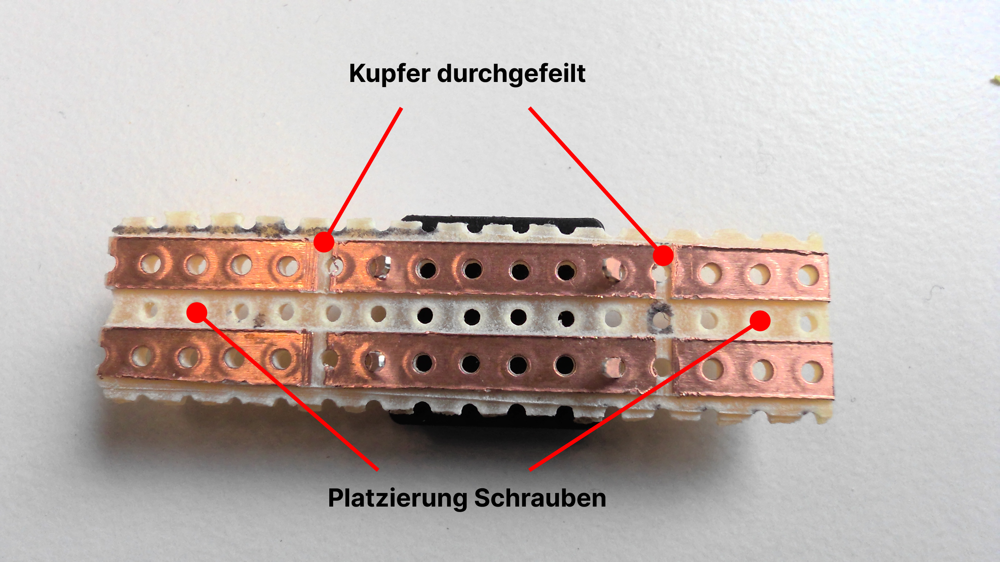
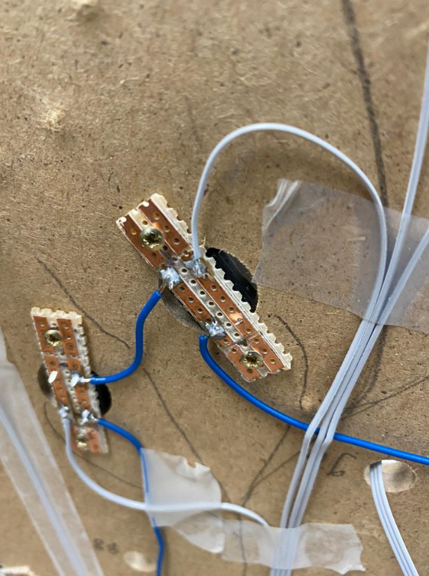
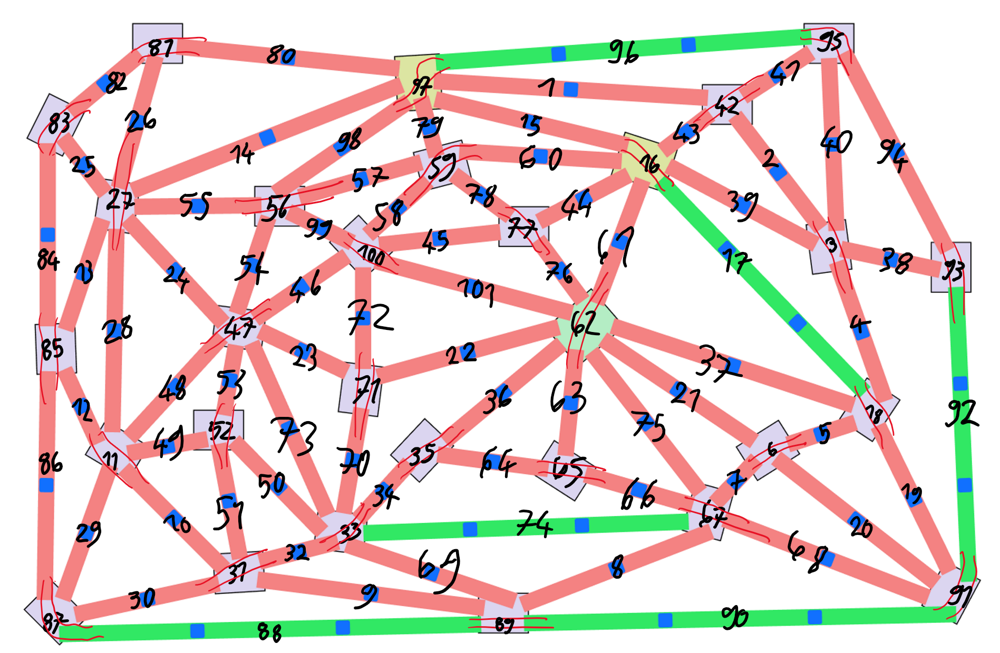
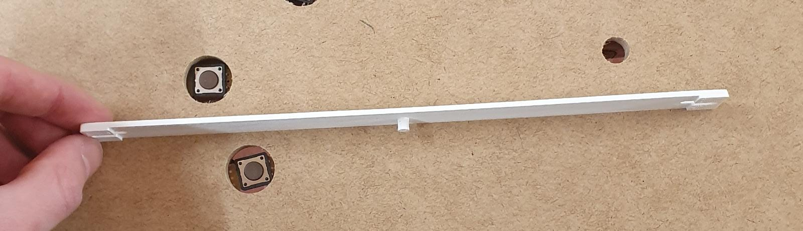
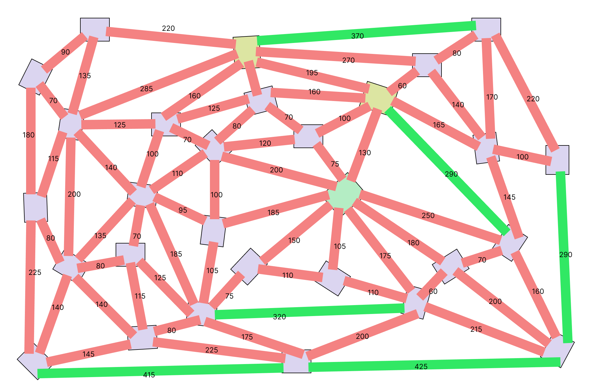
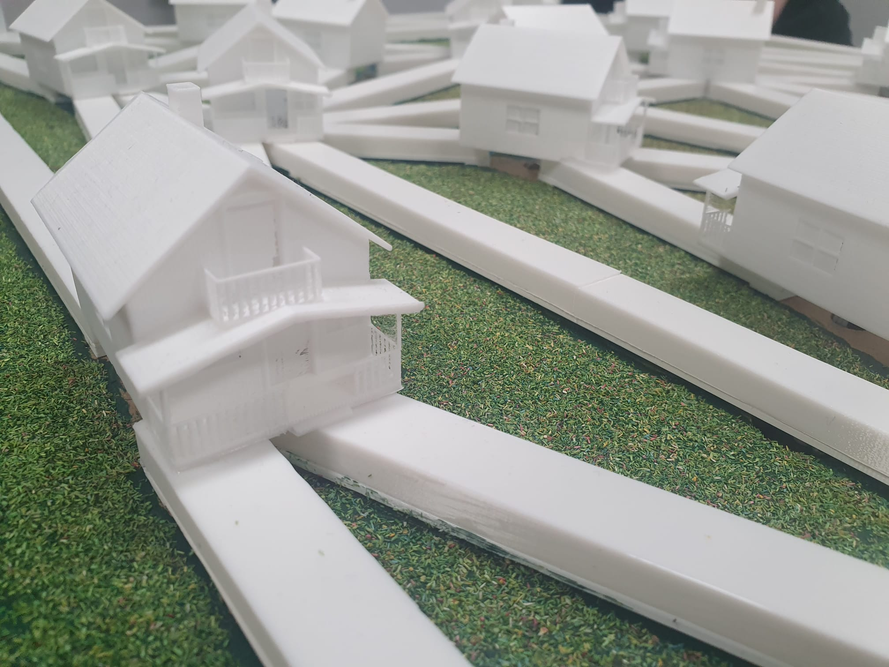
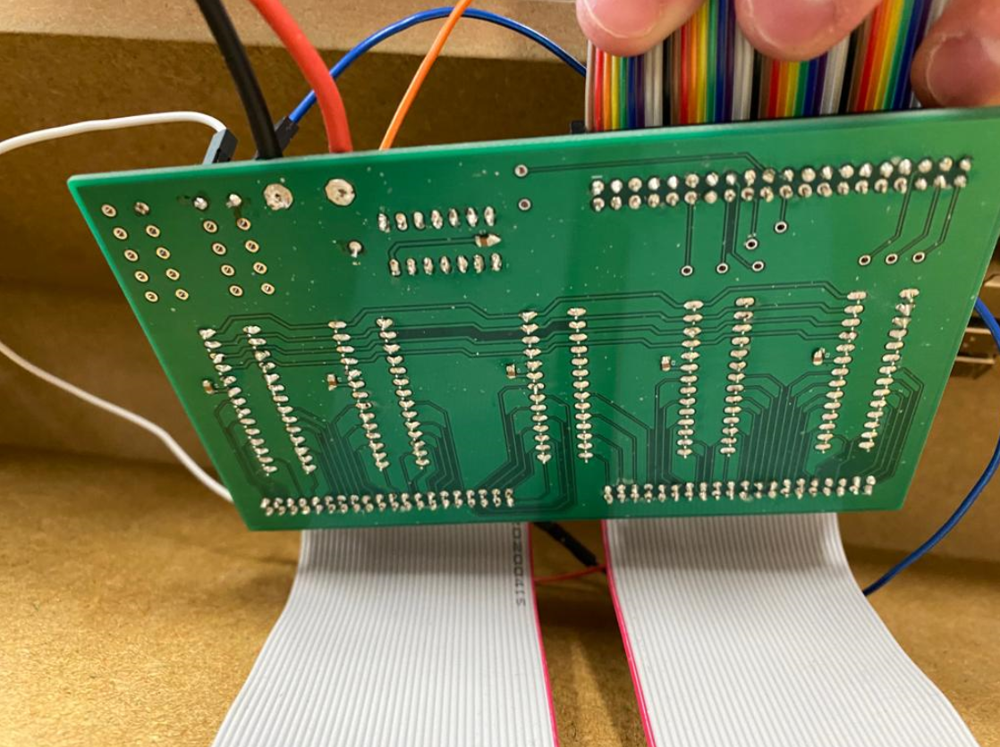
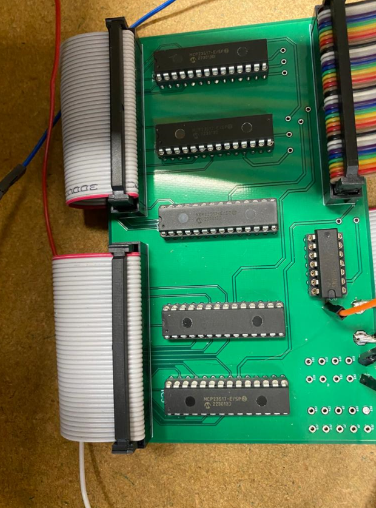

[[section-solution-strategy]]
== Techniken zum Löten

=== Buttons
****
Alle Buttons werden auf Europlatinen gelötet, die dann von unten mit 2.5x10 Holzschrauben an die Spielfläche geschraubt werden. Die Buttons werden alle elektrisch mit Ground und den GPIO-Extension-ICs verbunden. Weil es maker/schliesser sind, schalten sie also die inputs der ICs LOW bei Betätigung.

Um die Europlatinenstücke pro Button vorzubereiten müssen sie gemäss Bild zugeschnitten werden und die Kupferleiter durchgefeilt werden, um zu verhindern, dass der Schraubenkopf einen Kurzschluss des Buttons zur folge hat.

Button auf Europlatine

image::./images/Loeten/ButtonLoeten.PNG["Button loeten", align="center"]

Button verschraubt auf Spielfläche.

****

=== LEDs
****
Die LEDStrips müssen zugeschnitten werden. Viele müssen pro Kante zugeschnitten werden, aber einige sind Kantenübergreifend, weil sie gleich auch noch die Häuser visualisiernen.

Für das zuschneiden kann folgende Grafik als Referenz verwendet werden:

Sie zeigt alle LED-Segmente (Kanten und Häuser) der Reihe nach durchnummeriert. Zwei parallele rote Striche von einer Kante über ein Haus auf eine nächste Kante bedeutet, dass dort ein Durchgängiger LED-Strip verwendet wird. Andernfalls wird geschnitten. 

Beispiel: +
Segmente 80 bis und mit 98 sind ein durchgängiger Strip ohne Schnitt. +
Segmente 30 bis und mit 36 sind ein durchgängiger Strip ohne Schnitt.

Fürs zuschneiden müssen die LED-Strips an die Kanten gehalten werden und korrekt abgeschnitten werden. Für Segmente die Häuser visualisieren müssen Buckel von 6-8 LEDs aufgestellt werden um die Häuser genügend auszuleuchten.

Bei einem defekten LED, kann ganz einfach dieses LED ausgewechselt werden und mit den restlichen LED-Strip verbunden werden wie im Bild ersichtlich ist.

image::../images/Loeten/LEDLoeten.PNG["LEDStrip splicen", align="center"]
****

=== Led Unterlagen
****

Die Led Unterlagen sind unter den Led Srips und sind dafür zu ständig, damit man die Buttons gut klicken kann. Wir haben sie mit dem Prusa MK3s Drucker und weißem Filament gedruckt, es können aber auch andere drucker verwendet werden.

Hier ist eine Tabelle mit den Längen und Mengen der Kanten, die wir gedruckt haben:

[cols="1,1" options="header"]
|===
|*Länge (mm)* |*Menge*
|60    | 3 
|70    | 5 
|75    | 2 
|80    | 5 
|90    | 1 
|95    | 1 
|100 | 4 
|105 | 2 
|110 | 3 
|115 | 2 
|120 | 1 
|125 | 3 
|130 | 1 
|135 | 2 
|140 | 4 
|145 | 2 
|150 | 1 
|160 | 3 
|165 | 1 
|170 | 1 
|175 | 2  
|180 | 2 
|185 | 2 
|195 | 1 
|200 | 4 
|215 | 1 
|220 | 2 
|225 | 2 
|250 | 1 
|270 | 1 
|285 | 1 
|290 | 2 
|320 | 1 
|370 | 1 
|415 | 1 
|422 | 1 
|===

Die Befestigung der Kanten auf dem Brett erfolgt mit zwei Schrauben. Es ist wichtig, dass die Mitte der Kante genau über dem Loch mit dem Button liegt. Die Präzision bei dieser Ausrichtung ist entscheidend für die optimale Funktionalität des Buttons.

Bei den kürzeren Kanten gibt es nur auf einer Seite einen Abstandshalter. Bitte achten Sie darauf, dass diese Kanten auf der Seite mit dem Abstandshalter fest befestigt sind. Auf der Seite ohne Abstandshalter sollte die Schraube nicht so fest angezogen werden, um eine gute Klickbarkeit zu gewährleisten.

link:../resources/3D-Modelle/KanntenUnterlagen.zip[Kannten Unterlagen Zip]
****

=== Abdeckungen
****

Um die Blendung durch die LEDs zu reduzieren und sie besser zu schützen, haben wir Abdeckungen erstellt, die über die LED-Streifen geklebt werden. Diese Abdeckungen passen auf unsere LED-Unterlagen. Für die Abdekungen sollten die selben Längen wie bei den unterlagen verwendet werden.

Kleben der Abdeckungen:

Beim Anbringen der Abdeckungen sollte der Klebstoff nicht auf die gesamte Fläche der Abdeckung aufgetragen werden. Stattdessen empfehlen wir, etwa die Hälfte der Abdeckung mit Klebstoff zu bestreichen. Wir empfehlen dazu Modellbaukleber.

image::../images/Abdekungen.jpeg["Abdekungen", align="center"]

Nach dem Aufkleben jeder Abdeckung sollte überprüft werden, ob die Kante immer noch gut klickbar ist. Sollte dies nicht der Fall sein, muss die Abdekung nocheinmal entfernt werden und der Vorgang wiederholt werden.

Diese gedruckten Abdeckungen bieten nicht nur zusätzlichen Schutz für Ihre LEDs, sondern sorgen auch dafür, dass die Beleuchtung angenehmer für die Augen ist und das gesamte Gerät ein einheitlicheres und ansprechenderes Aussehen erhält.

link:../resources/3D-Modelle/Abdekung.stl[Abdekungen]

****

=== Häuser
****

Die Häuser bieten eine zusätzliche visuelle Verbesserung und diehnen dazu, dass die Ledstrips nicht blenden. Diese Häuser werden ebenfalls durch den 3D-Druckprozess erstellt und bestehen aus fünf Teilen, die einfach zusammengeklebt werden können.

Sobald die Häuser zusammengesetzt sind, werden sie über den Knotenpunkten (LED-Streifen) auf den Kanten platziert und befestigt. Dabei ist zu achten, dass die Kanten danach immer noch gut klickbar sind.

Die Häuser haben eine Grundfläche von 4x5 cm, was eine ausreichende Abdeckung für die meisten LED-Streifen bietet. Es gibt jedoch ein spezielles Haus, das alle LED-Streifen mit Strom versorgt. Aufgrund seiner zusätzlichen Funktionen ist dieses Haus etwas größer und hat eine Grundfläche von 5x6 cm.

link:../resources/3D-Modelle[Haus]

****

=== PCB / Platine
****
Der PCB verbindet alle Komponente auf Hardwareebene mit der Verkabelung.

****