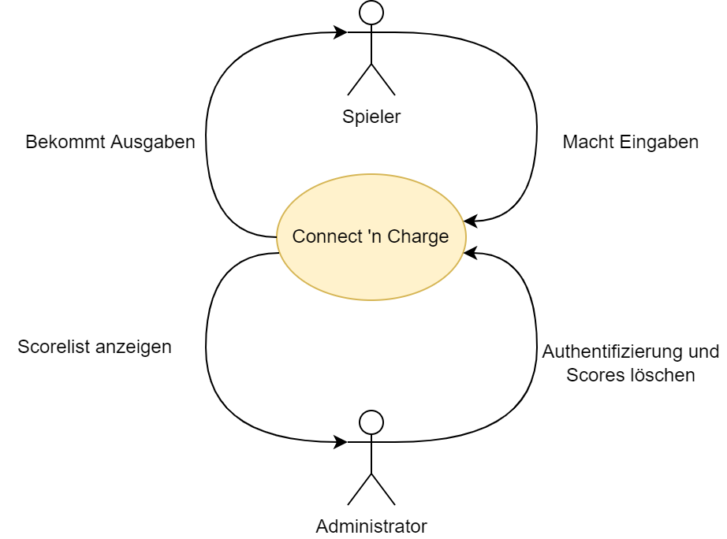

[[section-system-scope-and-context]]
== Kontextabgrenzung
In diesem Abschnitt wird der Kontext des Spiels "Connect 'n Charge" beschrieben, einschliesslich der Nutzergruppen und der Art der Interaktion mit anderen Systemen.

=== Fachlicher Kontext

[role="arc42help"]
****

.Spieler
Der Spieler kann auf die Ränder der Verbindungen klicken und darüber hinaus auch Eingaben auf dem Touchscreen machen.

.Administrator
Der Administrator kann mit einem einfachen Passwort auf den Highscore zugreifen und die Ergebnisse löschen. Auf diese Weise kann der Highscore bei besonderen Ereignissen einfach zurückgesetzt werden.

.Connect 'n Charge
Das Spiel "Connect 'n Charge" ist so konzipiert, dass der Spieler einen Touchscreen und die Tasten auf dem Spielbrett verwenden kann. Die Schaltflächen sind als Kanten auf dem Spielbrett symbolisiert, sodass der Spieler auf die Kanten drücken kann, um einen Knotenpunkt zu verbinden. Mit dem Touchscreen kann der Spieler dem Spiel Befehle geben, wie z.B. das Starten der Runde, wie z.B. das Beenden der Runde, oder den Befehl geben, die Lösung anzuzeigen. Darüber hinaus sollte der Touchscreen Informationen über die Kosten der aktuellen Verbindungen anzeigen.
Eine weitere Technik zur Anzeige von Spielausgängen sind die LEDs, die als Knoten und Kanten auf dem Spielbrett verteilt wurden. Diese LEDs sollen dem Spieler helfen, das Spiel besser zu überblicken, um schneller auf bestimmte Anforderungen reagieren zu können.
****

=== Technischer Kontext

[role="arc42help"]
****

image::.././images/technischerKontext.drawio.png["Technischer Kontext", align="center"]

.Textes-Files
In den Text-Files werden die Daten zum Steinerbaum und für den Highscore abgespeichert.

.Touchscreen
Der Touchscreen wurde gewählt, um Informationen über das Spiel besser anzeigen zu können. Darüber hinaus kann der Touchscreen Eingaben des Spielers annehmen und weiterleiten.

.LEDs
Wenn Knoten markiert oder miteinander angeschlossen sind, werden die zahlreichen eingebauten LEDs aktiviert.

.Drucktaste
Auf dem Spiel sind keine Knöpfe sichtbar angebracht, aber diese Knöpfe werden für die Informationsübertragung einer Knotenverbindung durch Drücken einer Kante verwendet. 
****

