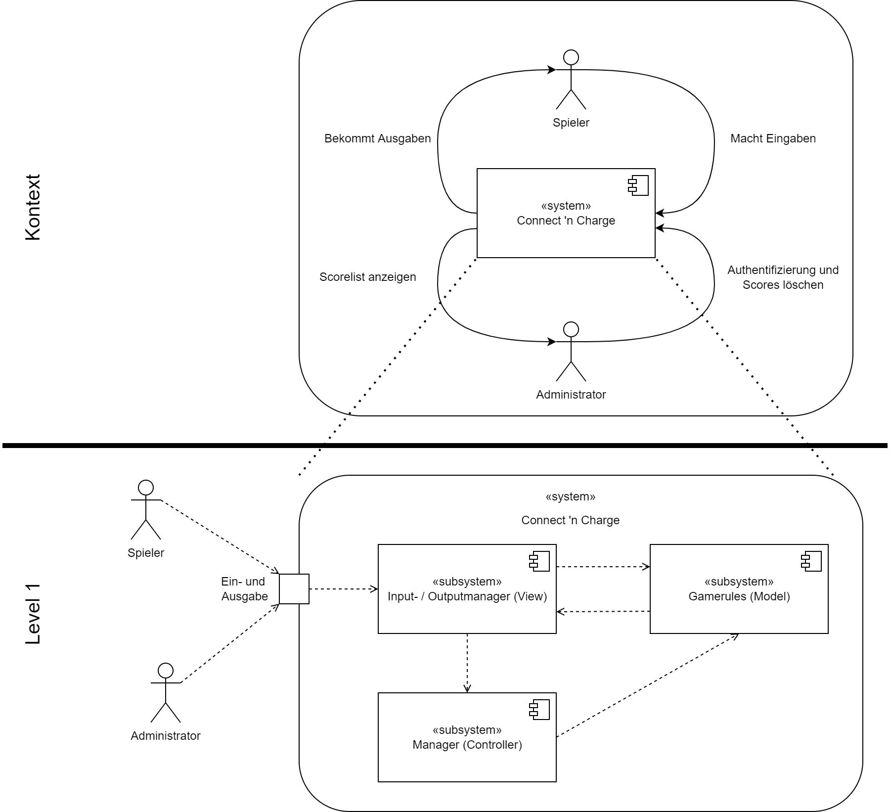

[[section-building-block-view]]
== Bausteinsicht

=== Whitebox Gesamtsystem
[role="arc42help"]
****

Durch den *Kontext* erhalten wir eine grobe Übersicht über das Spielsystem 'Connect 'n Charge', einschließlich seiner grundlegenden Konfiguration und Struktur.

Bei der Systemdarstellung wird die *Ebene 1* genutzt, um die grundlegenden Merkmale zu veranschaulichen, und darunter befindet sich die MVC-Struktur, die eine klare Trennung zwischen den verschiedenen Komponenten ermöglicht.

|===
|*Subsystem* |*Kurzbeschreibung*
//Row 1
|Input- / Outputmanager (View)
|Beinhaltet alle möglichen Hardwareverbindungen für die Software und ist somit die View.
//Row 2
|Manager (Controller)
|Der Manager erhält die Eingaben von der Ansicht und entscheidet dann, welche Logik im Modell aufgerufen werden soll.
//Row 3
|Gamerules (Model)
|Die Gamerules als Model enthalten die Logik des Spielsystems. Durch eine Eingabe des Spielers oder des Administrators führt der Manager die weitergeleiteten Befehle aus. Die Gamerules verarbeiten die Daten und senden sie direkt an den Outputmanager.
|===
****
