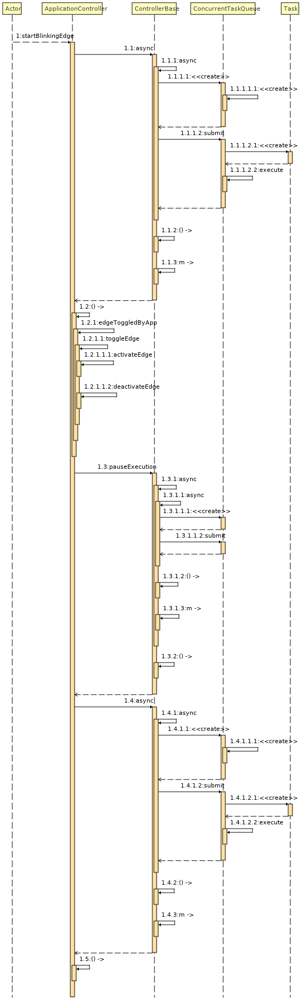
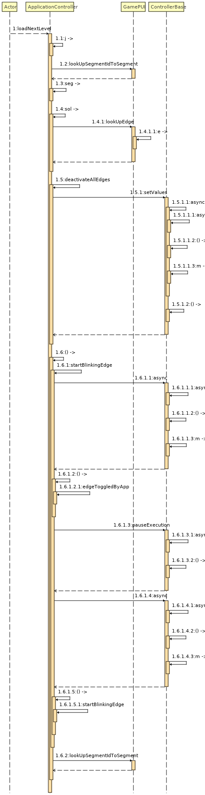
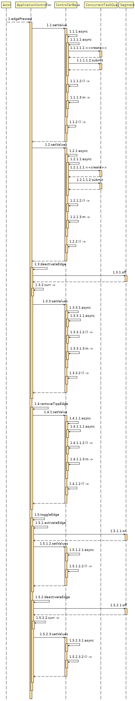
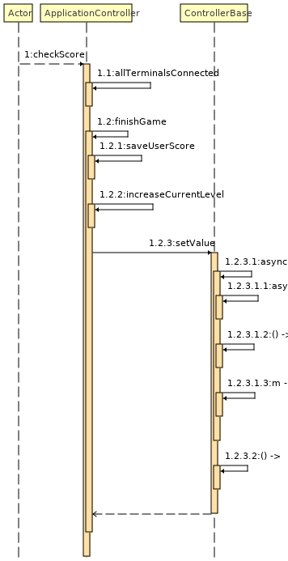
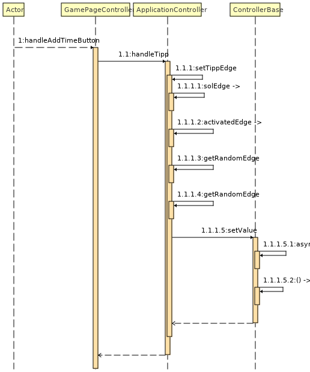

[[section-runtime-view]]
== Laufzeitsicht

Hier werden die wichtigsten Laufzeitszenarien dokumentiert.
Die Bilder geben einen guten Überblick über die Zusammenhänge.
Für Details sollten die https://ip12-22vt.pages.fhnw.ch/ip12-22vt_ladestationen/ip12-connectncharge/apidocs/ch.ladestation.connectncharge/module-summary.html[API-Docs (JavaDoc)]
konsultiert werden. Falls diese nicht zur Verfügung stehen kann
das Querschnittliche Konzept <<CI/CD>> zu Hilfe gezogen werden.
////
=== Schnittstelle Kanten und LEDs - Raspberry Pi
=== Zwei Knoten verbinden

[role="arc42help"]

****

.Inhalt
Diese Sicht erklärt konkrete Abläufe und Beziehungen zwischen Bausteinen in Form von Szenarien aus den folgenden Bereichen:

*  Wichtige Abläufe oder _Features_:
Wie führen die Bausteine der Architektur die wichtigsten Abläufe durch?
*  Interaktionen an kritischen externen Schnittstellen:
Wie arbeiten Bausteine mit Nutzern und Nachbarsystemen zusammen?
* Betrieb und Administration: Inbetriebnahme, Start, Stop.
* Fehler- und Ausnahmeszenarien

Anmerkung:
Das Kriterium für die Auswahl der möglichen Szenarien (d.h. Abläufe) des Systems ist deren Architekturrelevanz.
Es geht nicht darum, möglichst viele Abläufe darzustellen, sondern eine angemessene Auswahl zu dokumentieren.

.Motivation
Sie sollten verstehen, wie (Instanzen von) Bausteine(n) Ihres Systems ihre jeweiligen Aufgaben erfüllen und zur Laufzeit miteinander kommunizieren.

Nutzen Sie diese Szenarien in der Dokumentation hauptsächlich für eine verständlichere Kommunikation mit denjenigen Stakeholdern, die die statischen Modelle (z.B. Bausteinsicht, Verteilungssicht) weniger verständlich finden.

.Form
Für die Beschreibung von Szenarien gibt es zahlreiche Ausdrucksmöglichkeiten.
Nutzen Sie beispielsweise:

* Nummerierte Schrittfolgen oder Aufzählungen in Umgangssprache
* Aktivitäts- oder Flussdiagramme
* Sequenzdiagramme
* BPMN (Geschäftsprozessmodell und -notation) oder EPKs (Ereignis-Prozessketten)
* Zustandsautomaten
* ...

.Weiterführende Informationen

Siehe https://docs.arc42.org/section-6/[Laufzeitsicht] in der online-Dokumentation (auf Englisch!).

****
////

=== Blinkende Kante für den Spielstart

=== Runde wird geladen

=== Kante klicken

=== Lösung des Spielers prüfen

=== Tipp anwenden

...
