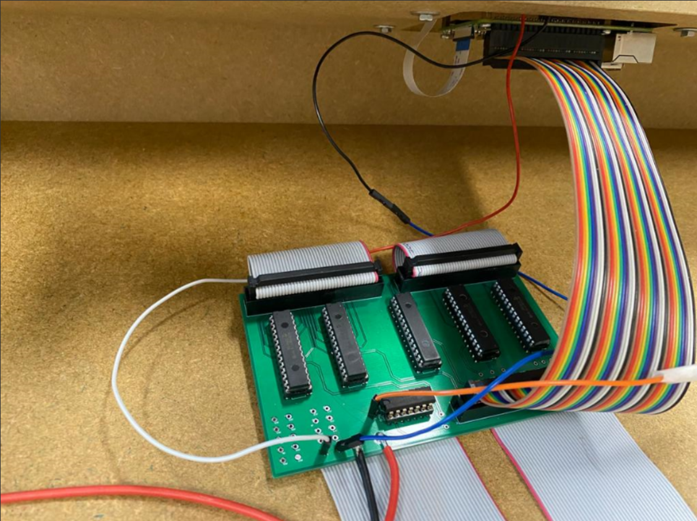
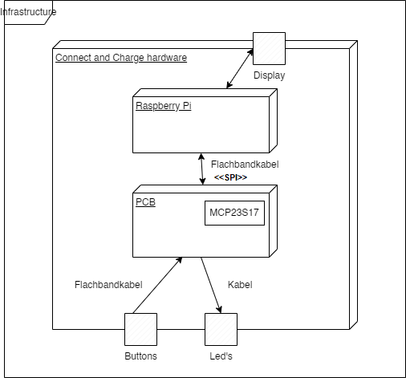

[[section-deployment-view]]
== Verteilungssicht
***
[[section-deployment-view]]
=== Infrastruktur Ebene 1
****

An dieser Stelle werden die einzelnen Hardwarekomponenten wie Raspberry Pi, Touchscreen, LED-Streifen, Buttons und das custom-PCB mit MCP23S17-Chips in einer Übersicht gezeigt.
Wichtig ist, dass aus Verteilungssicht der RaspberryPi die einzige Node ist, da das Programm ausschliesslich darauf läuft.
****
==== Umgebungen

[cols="1,4"]
|===
| Umgebung            
| Beschreibung

|Entwicklungsumgebung
|Die Entwicklungsumgebung ist der RaspberryPi in der Connect-n-Charge-Box an der FHNW Brugg-Windisch.

| Testumgebung        
| Gleich wie die Entwicklungsumgebung

| Produktionsumgebung 
| Die Produktionsumgebung ist der RaspberryPi in der Connect-n-Charge-Box bei der externen Auftraggeberin Primeo. 
Die Hardware wird in Workshops/Ausstellungen platziert.
|===

****

Der RaspberryPi dient als zentrale Verarbeitungseinheit und Kommunikationsschnittstelle zwischen den verschiedenen Eingabe- und Ausgabekomponenten. Der Touchscreen ermöglicht eine intuitive Benutzeroberfläche, während die Buttons und der LED-Streifen für Interaktionen und visuelles Feedback sorgen. Das benutzerdefinierte PCB dient zum effizienten auslesen der 80 Buttons via SPI interface
****

==== Qualitäts- und/oder Leistungsmerkmale
****
Die Infrastruktur bietet eine robuste und zuverlässige Plattform für das Brettspiel. Der Raspberry Pi 4 bietet ausreichend Rechenleistung und Speicher für die Verarbeitung der Spiellogik und Interaktionen.
****
==== Zuordnung von Bausteinen zu Infrastruktur
****
****	
===== Raspberry-Pi
****
Hauptverarbeitungseinheit, Kommunikation mit Touchscreen, LED-Streifen und benutzerdefiniertem PCB über SPI
****
===== Touchscreen
****
Eingabe- und Ausgabegerät für Benutzerinteraktionen
****
===== LED's (WS2811)
****
Visuelle Darstellung von Spielinformationen
****
===== Buttons
****
Eingabegeräte für Spieleraktionen
****
===== PCB
****
Zustandsüberwachung der Buttons über 5 MCP23S17-Chips. Weitergabe an RaspberryPi
****

