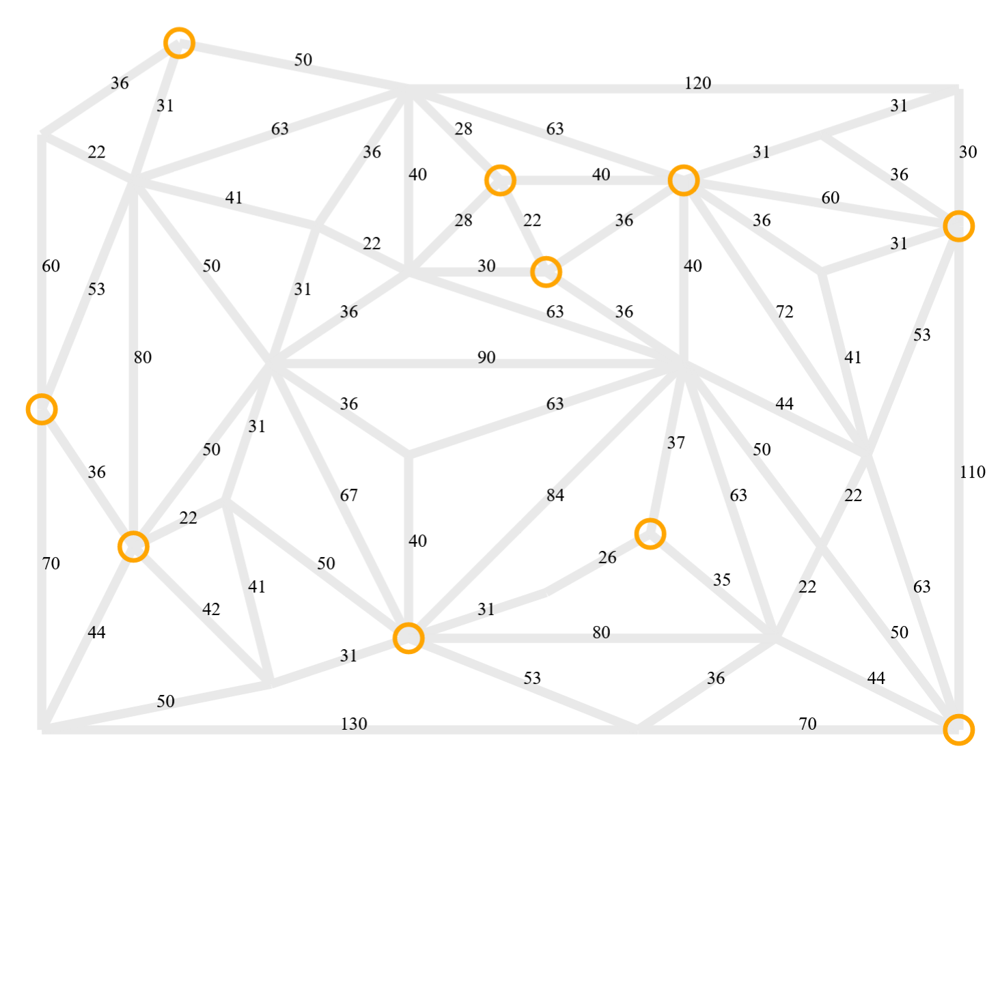

[[section-design-decisions]]
== Architekturentscheidungen

[role="arc42help"]
////
****
.Inhalt
Wichtige, teure, große oder riskante Architektur- oder Entwurfsentscheidungen inklusive der jeweiligen Begründungen.
Mit "Entscheidungen" meinen wir hier die Auswahl einer von mehreren Alternativen unter vorgegebenen Kriterien.

Wägen Sie ab, inwiefern Sie Entscheidungen hier zentral beschreiben, oder wo eine lokale Beschreibung (z.B. in der Whitebox-Sicht von Bausteinen) sinnvoller ist.
Vermeiden Sie Redundanz.
Verweisen Sie evtl. auf Abschnitt 4, wo schon grundlegende strategische Entscheidungen beschrieben wurden.

.Motivation
Stakeholder des Systems sollten wichtige Entscheidungen verstehen und nachvollziehen können.

.Form
Verschiedene Möglichkeiten:

* ADR (https://cognitect.com/blog/2011/11/15/documenting-architecture-decisions[Documenting Architecture Decisions]) für jede wichtige Entscheidung
* Liste oder Tabelle, nach Wichtigkeit und Tragweite der Entscheidungen geordnet
* ausführlicher in Form einzelner Unterkapitel je Entscheidung

.Weiterführende Informationen

Siehe https://docs.arc42.org/section-9/[Architekturentscheidungen] in der arc42 Dokumentation (auf Englisch!).
Dort finden Sie Links und Beispiele zum Thema ADR.
////

=== Warum wurde JavaFXML gewählt?
****
Die Entscheidung, JavaFXML anstelle von JavaFX zu verwenden, wurde von der Gruppe bewusst getroffen, da sie an die Vorteile glaubte, die es bietet. JavaFXML ist eine Erweiterung von JavaFX, die es ermöglicht, die Benutzeroberfläche einer Anwendung deklarativ in einer separaten XML-Datei zu definieren und dann dem zugehörigen Java-Code zuzuordnen. Dieser Ansatz hat viele Vorteile:

Trennung von Design und Logik: Die Verwendung von FXML ermöglicht eine klare Trennung von UI-Layout und -Design von der Logik dahinter. Dies verbessert die Zusammenarbeit zwischen Designern und Entwicklern, da sie unabhängig voneinander arbeiten können. Die Benutzeroberfläche kann in Scenebuilder erstellt und angepasst werden, während Java-Code entwickelt wird, der die Anwendungslogik und Interaktionen steuert. Einfachere Wartung und Anpassung: Durch die Trennung von Design und Logik wird es einfacher, Änderungen an der Benutzeroberfläche vorzunehmen, ohne den Java-Code anzupassen. Das Layout und der Stil der Benutzeroberfläche können in Scenebuilder geändert werden und die Änderungen werden automatisch in der FXML-Datei gespeichert, ohne dass der Java-Code angepasst werden muss. Dies erleichtert die Wartung und Anpassung der App.

Wiederverwendbarkeit und Testbarkeit: Die Verwendung von FXML ermöglicht die Erstellung separater Module für bestimmte UI-Komponenten oder Ansichten, die wiederverwendet werden können. Diese Modularität erleichtert die Entwicklung und Wartung der Anwendung. Darüber hinaus kann die Benutzeroberfläche einfacher getestet werden, indem Testdaten in die FXML-Datei eingefügt und die Benutzeroberfläche in verschiedenen Zuständen überprüft werden.

Warum der Scenebuilder verwendet wird:

Um die UI-Entwicklung weiter zu vereinfachen, wird der Scenebuilder als grafisches Tool verwendet. Der Scenebuilder ist ein visueller Editor, mit dem die Benutzeroberfläche interaktiv gestaltet werden kann. Verschiedene UI-Komponenten lassen sich per Drag-and-Drop platzieren, Eigenschaften anpassen und Effekte direkt im Vorschaufenster betrachten. Der Scenebuilder generiert automatisch den entsprechenden FXML-Code, der in die Anwendung integriert werden kann. Die Verwendung von Scenebuilder erleichtert die Zusammenarbeit zwischen Designern und Entwicklern erheblich, da das visuelle Tool es den Designern ermöglicht, ihre Ideen schnell und effizient umzusetzen, während der generierte FXML-Code von den Entwicklern weiter modifiziert werden kann, um den spezifischen Anforderungen der Anwendung gerecht zu werden.

****

=== Welche Architekturbasis wurde gewählt?
****
Es wurde die MVC-Archtektur gewählt. Der Grund dafür ist, dass das https://github.com/Pi4J/pi4j-template-javafx[Template Projekt]
Diese Architektur verwendet und eine äusserst gute Infrastruktur bietet. Dies hilft, um Aufwand für Basic-Boilerplate code stark zu reduzieren.
****

=== Wie wurde die Power-Supply-Unit gewählt?
****
Basierend auf den Kantenkosten wird die Länge des benötigten LED-Strips berechnet.
Es wird angenommen, dass der maximal mögliche Stromverbrauch für alle Kanten 1210W beträgt,
aber da in der Praxis nur etwa 15 Kanten aktiv sind, wird der Stromverbrauch auf 20A geschätzt,
was auch durch Tests bestätigt wird. Es wird empfohlen, LED-Strips mit 60LEDs/m zu verwenden,
um den Stromverbrauch zu reduzieren und eine effizientere Stromversorgung zu gewährleisten.

1. Die untere Kante des LED-Spiels ist 1,5m lang und kostet 200 Einheiten.
    Dies ergibt eine Kostenrate von 133,33 Einheiten pro Meter (200 Einheiten ÷ 1,5m).

2. Die Gesamtkosten des Spiels betragen aus dem Prototypen 3601 Einheiten.

3. Um die Länge des benötigten LED-Strips zu berechnen, multiplizieren wir die Gesamtkosten des Spiels
    mit der Kostenrate pro Meter: 3601 Einheiten × (1,5m ÷ 200 Einheiten) = 27m.

4. Wir fügen eine Reserve von einem Meter hinzu, um sicherzustellen, dass der LED-Strip ausreichend lang ist: 27m + 1m = 28m.

5. Der maximale Stromverbrauch des Spiels ergibt sich aus der Anzahl der LEDs und der Stromstärke pro LED.
    Wir nehmen an, dass wir LED-Strips mit 60 LEDs/m und 20mA pro LED verwenden.
    Daher beträgt der maximale Stromverbrauch: 60 LEDs/m × 3 Farben × 0,02A/LED × 28m × 5V = 504W.

****

=== Warum wurde ein custom PCB erstellt?
****
Im Prototyp des Produkts wurde kein PCB verwendet und nur 2 ICs verbaut. Es wurde schnell klar, dass diese Methode schlecht skaliert. Alle Verbindungen von 6 ICs (5 GPIO-Extenders und 1 Logic-Level-Shifter) fehlerfrei manuell herzustellen birgt ein zu grosses Risiko von Verbindungsfehlern oder Kurzschlüssen. Ausserdem ist die Fehleranfälligkeit während des Betriebs durch ein PCB stark reduziert, da die Verbindungen viel zuverlässiger sind.
****