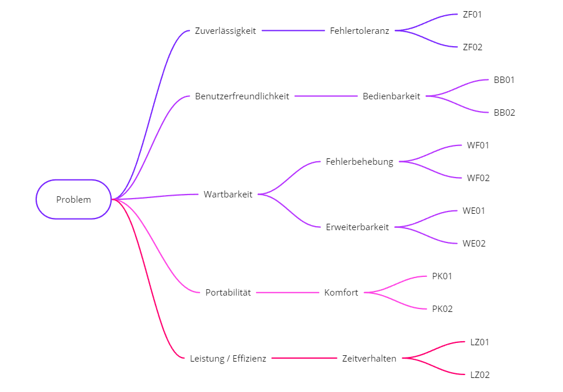

[[section-quality-scenarios]]
== Qualitätsanforderungen

=== Qualitätsbaum

[role="arc42help"]
****

****

=== Qualitätsszenarien

[role="arc42help"]
****

Die Qualitätsziele sind in [Kapitel 1.1] aufgeführt und hier mit Szenarien versehen.

[cols="1,2,6" options="header"]
|===
|*ID* |*Szenario* |*Beschreibung*
//Row 1
|ZF01
|Falsche Verbindung erkennen
|Das Spiel erkennt falsch gegebene Verbindungen an. Die Spielrunde wird somit nicht beendet.
//Row 2
|ZF02
|Priorität bei gleichzeitigem Drücken
|Wenn beide externen Buttons gleichzeitig gedrückt werden, wird nur der Befehl ausgeführt, der schneller war.
//Row 3
|BB01
|Start des Levels
|Der Spieler erkennt, dass er den angezeigten Kante drücken muss, um eine Verbindung über ein ausgeschaltete Knote herzustellen.
//Row 4
|BB02
|Fehlerhafte Verbindung
|Das Spiel erkennt falsch gegebene Verbindungen an. Die Spielrunde wird somit nicht beendet und ein Hinweis wird angezeigt, dass alle blauen Knoten verbunden wurden, aber es ist noch nicht der kostengünstigsten Weg
//Row 5
|WF01
|Austausch eines defekten LED
|Das Entwicklerteam kann neue LEDs, wie im SAD beschrieben wurden, ersetzen.
//Row 6
|WF02
|Austausch eines defekten Buttons
|Das Entwicklerteam kann neue Buttons, wie im SAD beschrieben wurden, ersetzen.
//Row 7
|WE01
|Einfügen neuer Levels
|Das Entwicklerteam kann neue Levels erstellen und einfach in den Level-Ordner des Spiels als Text-Datei einfügen, um sie ins Spiel zu integrieren.
//Row 8
|WE02
|Anpassung der Highscore-Liste
|Der Administrator kann auf der Admin-Seite des Spiels Highscores löschen.
//Row 9
|PK01
|Tragbarkeit des Spiels
|Das Spiel kann von zwei gesunden erwachsenen Person problemlos getragen werden. Dabei wurden zwei Griffe an den Seiten anmontiert.
//Row 10
|PK02
|Stabilität des Spiels
|Das Spiel ist stabil und kann ohne Probleme angehoben werden.
//Row 11
|LE01
|Reaktionszeit auf Spielereingaben
|Der Spieler sieht die Kostenänderung auf dem Touchscreen in weniger als einer Sekunde, wenn er mitten in einer Spielrunde eine Kante drückt.
//Row 12
|PK02
|Effizienz des Steinerbaums
|Der Spieler kann den Steinerbaum effizient konstruieren und dabei die geringsten Kosten und die Spielzeit optimieren.
|===

****
