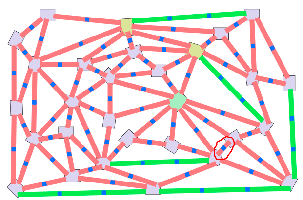

== Testfall T01-04

[[T01-04]]
=== Testfall-ID
T01-04

=== Requirement
F01.R002

=== Kurzbeschreibung
Prüfen, ob das Licht durch Betätigen der Schaltfläche auf einer Kante mit einem Button ausgeschaltet werden kann.

=== Voraussetzung

* Das Spiel ist mit dem Stromkreislauf verbunden.
* Eine Spielrunde wurde gestartet.
* Nur die kürzeste waagerechten Kante, welche mit einer roten Linie im Bild umrandet wurde, wurde gedrückt und somit leuchtet sie in einem blauen Farbton auf.

==== Eingabe

1) Auf der leuchtende Kante drücken.

==== Ausgabe
2) Das blaue Licht der Kante schaltet sich.

